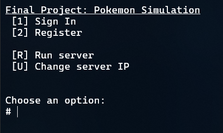
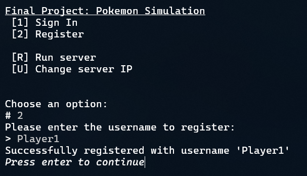
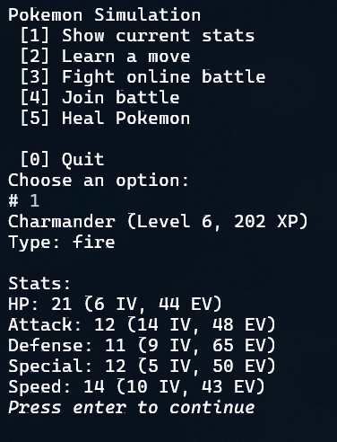
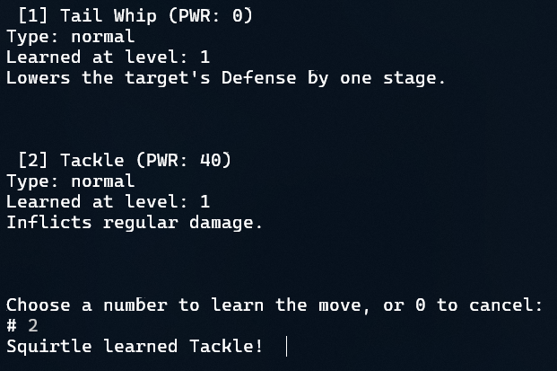
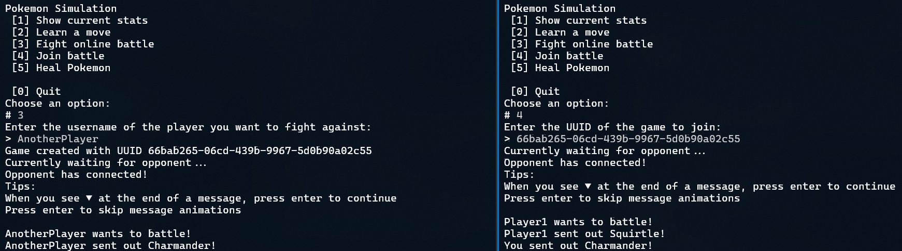
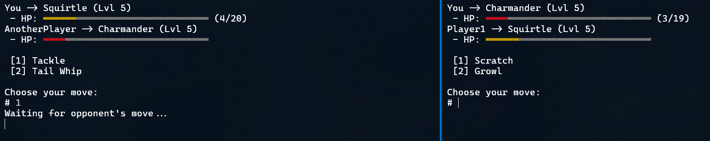

# Final Project: Pokemon Simulation

This Java project simulates a Pokemon battle, using Pokemon stats from [PokeAPI](https://pokeapi.co/). It includes online multiplayer support with a dedicated server using WebSockets.

# Code Breakdown

## `App.java`
- Handles the main client interaction
- ### `public static void main(String[] args)`:
  - The primary and first method that the client runs
  - Contains the main menu, showing inputs for logging in, registering an account, and managing Pokemon:
    - Show current stats of Pokemon
    - Heal Pokemon back to max HP
    - Learn a move
    - Fight another player or join a fight initiated by another player
  - When registering:
    - Asks for a username to register
    - Creates a POST request to register the user
  - When logging in:
    - Asks for the username to log into
    - Sends a GET request to retrieve information such as the Pokemon the user owns
    - If the user doesn't own any Pokemon yet, ask the user for a Pokemon to own
    - Creates a new `Pokemon` object and fetches its stats from the API
    - Creates a POST request to save the Pokemon in the multiplayer server
  - Calls other methods in `App.java` in the main menu depending on Scanner input
- ### `private static void learnMove(Scanner scan)`:
  - Allows the user to make the Pokemon learn a new move
  - Gets all possible moves the Pokemon can learn
  - Filters the moves by whether the Pokemon has a high enough level, and asks the user to choose the move to learn
  - If Pokemon has less than 4 moves, directly learn the move
  - If Pokemon has 4 moves already, prompt the user to forget an old move to learn the new one
  - Creates a PUT request to multiplayer server to save the Pokemon
- ### `private static void onlineBattle(Scanner scan)`:
  - Asks for the username of the player to fight
  - Creates a POST request to multiplayer server to create the game, and outputs a UUID
  - Creates a new `ClientBattle` object with the UUID to play the game
  - Saves the resulting `Pokemon` and `User` objects to the instance variables in `App`
  - Creates a PUT request to multiplayer server to save the Pokemon (in case it gained XP from the battle)
- ### `private static void joinBattle(Scanner scan)`:
  - Asks for the UUID of the game (obtained when `onlineBattle()` is called)
  - Creates a new `ClientBattle` object with the user inputted UUID to join the game
  - Saves the resulting `Pokemon` and `User` objects to the instance variables in `App`
  - Creates a PUT request to multiplayer server to save the Pokemon (in case it gained XP from the battle)
- ### `private static void healPokemon()`:
  - Sets the `currentHP` instance variable in the Pokemon to the `hpStat` instance variable, healing the Pokemon back to max HP
  - Creates a PUT request to multiplayer server to save the Pokemon with its new HP
- ### `private static PokemonMove chooseMove(ArrayList<PokemonMove> moves, String ask, Scanner scan)`:
  - Helper method to list all moves and their information in the `moves` ArrayList, then use Scanner to ask the user to choose a move
  - If user inputs 0, return `null`
  - Used for asking the user which move to learn and which move to forget
- ### `private static void updateServer(Pokemon pokemon, int index)`:
  - Helper method to create the POST request to save the Pokemon in the server

## `Server.java`
- Handles the backend part of the project (the multiplayer server)
- Uses [Javalin](https://javalin.io/) to host the API and the WebSocket
- ### Main instance variables:
  - `HashMap<String, User> usersDatabase`: Contains key-value pairs of `User` objects and their usernames
  - `HashMap<String, OnlineGame> gamesDatabase`: Contains key-value pairs of `OnlineGame` objects and their UUIDs
- ### `public static void main(String[] args)`:
  - Initializes the server's endpoints, retrieves the database from `users.json`, and starts the server
- ### `public static void saveDb()`:
  - Save the contents of `usersDatabase` in `users.json`
- ### `public static void loadDb()`:
  - Retrieve the user database from `users.json` and store it in `usersDatabase`
- ### `public static void init()`:
  - Creates a new `Javalin` object
  - Uses the object to listen for API endpoints:
    - `GET /` -> Just returns `Hello World`
    - `POST /users` -> Registers a new user in `usersDatabase`
    - `GET /users/{username}` -> Returns information about the user by their username, including their Pokemon
    - `GET /users/{username}/pokemons` -> Returns information about all Pokemons that the user owns
    - `POST /users/{username}/pokemons` -> Adds a new Pokemon that the user owns
    - `GET /users/{username}/pokemons/{index}` -> Returns information about one specific Pokemon that the user owns
    - `PUT /users/{username}/pokemons/{index}` -> Modifies a Pokemon that the user owns, replacing it with a new Pokemon
    - `POST /games` -> Creates a new `OnlineGame` object in `gamesDatabase` and outputs the object, including its UUID
    - `GET /games/{uuid}` -> Returns information about a specific game in `gamesDatabase`
    - All methods that modify a player or a Pokemon it owns saves the users database by calling the `saveDb()` method
  - Listens for a WebSocket connection at the endpoint `/games/{uuid}/ws`
    - Retrieves the game from `gamesDatabase` and sends a message containing the game state on initial connection
    - Connects the WebSocket connection to the `OnlineGame` object based on whether the player is player 1 (created game) or player 2 (joined game)
    - When WebSocket connection closes for both players, delete the `OnlineGame` object from `gamesDatabase` to free up RAM
- ### `public static void start()`:
  - Starts the API server and listens on the local network for API calls
- ### `public static void stop()`:
  - Stops the API server

## `User.java`
- Contains information about a specific user
- Currently only contains the Pokemons the user has
- Only contains a constructor to initialize the username and the `ArrayList` of Pokemons, and setter/getter methods

## `LevelRate.java`
- Contains information about how much XP is required for a Pokemon to level up
- Fetches data from PokeAPI
- ### `public int getLevel(int xp)`:
  - Returns the level of a Pokemon given the amount of XP it has
- ### `public int getTotalXp(int level)`:
  - Returns the amount of XP required for a Pokemon to reach a specific level

## `Pokemon.java`
- Contains all the information about an individual Pokemon
- ### `public Pokemon(String name, int level, boolean wild)`:
  - Initializes instances variables
  - Generates IVs (individual values, or randomized "genetics" of a Pokemon; a random number from 0-15 for each stat that is a factor in stat calculation)
- ### `public void fetchData()`:
  - Fetches data from PokeAPI about the Pokemon
  - Saves all the required stats in the instance variables
  - Calculates the current stats using the saved stats (by calling `calculateStats()`)
- ### `public boolean learnMove(PokemonMove move)`:
  - Adds a new move to the `Pokemon` object's `learntMoves` array
  - Overwrites the first null variable
  - Returns true if successfully learned (spot available to learn move), and false otherwise (already knows 4 moves and needs to forget an old one)
- ### `public boolean forgetMove(PokemonMove move)`:
  - Removes a value in the `learntMoves` array, overwriting with null
  - Returns true if move was in array, and false otherwise
- ### `private void calculateStats()`:
  - Calculates the current stats of the Pokemon using its base stats, IV (individual values, mentioned earlier), and EV (effort values, a number for each stat that increases by defeating another Pokemon)
  - Uses the formula in [Bulbapedia](https://bulbapedia.bulbagarden.net/wiki/Stat#Generations_I_and_II)
- ### `public void defeatPokemon(Pokemon otherPokemon)`:
  - Increases the XP and EV values based on another Pokemon
  - XP gain uses the formula in [Bulbapedia](https://bulbapedia.bulbagarden.net/wiki/Experience#Gain_formula)
  - EV gain is just the base stat for each stat
  - Used when one Pokemon defeats another Pokemon
- ### `public int calculateDamageTaken(PokemonMove move, Pokemon attackingPokemon)`:
  - Calculates the amount of damage the Pokemon takes depending on the move used and the stats of the other Pokemon
  - Uses formula in [Bulbapedia](https://bulbapedia.bulbagarden.net/wiki/Damage#Generation_I)

## `PokemonMove.java`
- Contains information for a Pokemon move
- Fetches data from PokeAPI
- Primarily contains getters and setters for other classes to use

## `OnlineGame.java`
- Handles the WebSocket connection between the client and the backend during a battle
- Listens for messages sent from the client
- ### `public void connectPlayer1(WsConnectContext ctx)`:
  - Sends an initial game state to the client for player 1, containing full information about each player, including Pokemon
  - Saves the `WsContext` object from Javalin for player 1, allowing the server to send messages back to the client
  - Checks if both players are connected by calling `checkBothConnected()`
- ### `public void connectPlayer2(WsConnectContext ctx)`:
  - Identical to `connectPlayer1()`, but for player 2
- ### `private void checkBothConnected()`:
  - If both players are connected:
    - Get the first Pokemon from each player and use it for the battle
    - Create a new `BackendBattle` object to handle the battle itself
    - Listen for messages from the client by calling `wsListen()`
- ### `private void wsListen()`:
  - Listens for when a client sends a message that it used a specific move, and calls the move use method in the `BackendBattle` object
- ### `public void broadcastToAll(String message)`:
  - Broadcast a message to all clients by sending a message to each `WsContext` object

## `BackendBattle.java`
- Handles the battle itself in the backend
- ### `public void p1UseMove(PokemonMove move)`:
  - Save the move that player 1 used
  - Check if both players used their move on their turn by calling `bothUseMove()`
- ### `public void p2UseMove(PokemonMove move)`:
  - Same as `p1UseMove()`, but for player 2
- ### `public void bothUseMove()`:
  - Check if both players used a move
  - Check each move priority and the speed stat of each Pokemon to determine which Pokemon uses its move first
  - Calculate damage done using `Pokemon.calculateDamageTaken()`
  - Broadcasts to the clients all the information calculated for the current round using `OnlineGame.broadcastToAll()`, including:
    - Which Pokemon used its move first
    - The move that each Pokemon used
    - How much damage each Pokemon dealt
    - The new HP of each Pokemon

## `ClientBattle.java`
- Handles the battle on the client side
- Uses `WebSocketClient` from [Java-WebSocket](https://github.com/TooTallNate/Java-WebSocket)
- ### `public void connectWs()`:
  - Creates a new `WebSocketClient` object and connects to the WebSocket
  - Listens for messages from the WebSocket server and passes it to the `onMessage()` method
- ### `public void onMessage(JSONObject message)`:
  - Handles the different types of messages that the server can send to the client
    - `GAME_STATE`: Initializes the player and Pokemon instance variables in the class, and determines if the client is playing as player 1 or 2
    - `START_GAME`: Starts the main game loop in `startBattle()`
    - `MOVES_USED`: Handles setting the health of each Pokemon and displaying the moves used, and checks if the game has ended (a Pokemon has been defeated)
    - `CONNECTION_ERROR`: Displays an error to the client
- ### `public void connectToBattle()`:
  - The method that other classes call to connect to the WebSocket and play in the battle
  - Uses a [`CountDownLatch`](https://docs.oracle.com/javase/8/docs/api/java/util/concurrent/CountDownLatch.html) to pause other code execution until battle finishes
- ### `public void startBattle()`:
  - Starts the battle and shows the initial battle dialogue
  - Calls `showMenu()` to start the main game loop
  - On game finish, close WebSocket connection and release the `CountDownLatch` to continue code execution
  - Uses a `Thread` object to start the game in a different thread, so the `WebSocketClient` is still able to listen for messages
- ### `private void showMenu()`:
  - Starts a loop that continues until the game ends
  - On each iteration, show the moves to use and ask for which move to use, then call `useMove()` to send the move to the server
- ### `private void useMove(int moveIndex)`:
  - Sends a message to the WebSocket server with the move used
  - Uses a `CountDownLatch` to pause code execution until the opponent uses a move
- ### `private void movesUsed(JSONObject message)`:
  - Called when a `MOVES_USED` message is sent from the WebSocket server
  - Displays the moves each Pokemon used and updates the health of each Pokemon
- ### `private boolean checkWin(Scanner scan)`:
  - Checks if either Pokemon's health is 0
  - If a Pokemon's HP is 0, send fainted message and update XP/EV values of winning Pokemon by calling `Pokemon.defeatPokemon()`

## `Constants.java`
- Contains constants that is used throughout the program
- `POKEAPI_BASE = "https://pokeapi.co/api/v2"`: The API base of PokeAPI
- `GENERATION = "red-blue"`: The generation of Pokemon this program emulates (used for filtering out newer-generation information in the API)
- `SERVER_API_BASE = "http://localhost:4321"`: The default multiplayer server API base; is user-customizable in `App.java`
- `WS_API_BASE = "ws://localhost:4321"`: Same as `SERVER_API_BASE`, but for the WebSocket
- `objectMapper = new ObjectMapper()`: The [Jackson ObjectMapper](https://www.baeldung.com/jackson-object-mapper-tutorial) that this program uses to convert classes to JSON and JSON to classes

## `JSONTools.java`
- A helper class to make parsing through `JSONObject` objects easier
- ### `public static String getString(JSONObject object, String path)`:
  - Gets a String value at a nested path of a `JSONObject`
  - Splits the path by every period, then loops through the split path with the following steps:
    - Gets the value using the path that was split, and store it
    - If the current value is a `JSONObject`, get the value using the key
    - If the current value is a `JSONArray`, get the value by converting the key String to an index int using `Integer.parseInt()`, then get the value using the index
    - If the current value is `null`, break out of the loop and return `null`
- ### `public static int getInt(JSONObject object, String path)`:
  - Gets an int value at a nested path of a JSONObject
  - Does the same steps as `getString()` to get the nested value

## `PokeAPITools.java`
- Contains methods to make parsing through PokeAPI responses easier
- ### `public static String getEnglishString(JSONArray dataArr, String key)`:
  - Get the English translation of a specific object, since the API returns translations of every language for every object

## `WebRequests.java`
- Contains methods to make API requests easier
- ### Main instance variables:
  - `HashMap<String, String> cache`: Contains key-value pairs of API endpoints and their responses
- ### `public static String getText(String endpoint)`:
  - Fetches the response from an API endpoint with a GET request and returns it as a String
  - If the API endpoint is in the `cache` object, then just return the value in there instead of fetching the response
- ### `public static JSONObject getJson(String endpoint)`:
  - Does the same thing as `getText()`, but returns it as a JSONObject instead of as a String
- ### `public static JSONObject postJson(String endpoint, String json)`:
  - Sends a POST request to the API endpoint with a JSON request body
  - Does not use a cache, since it is sending data to the API
- ### `public static JSONObject putJson(String endpoint, String json)`
  - Does the same thing as `postJson()`, but with a PUT request instead of a POST request

## `Utils.java`
- Contains general helper methods for non-specific topics
- ### `public static void slowPrintln(String str, int speed, Scanner scan)`:
  - Prints a string slowly, with characters one at a time
  - Uses a loop to print one character at a time
  - Uses `TimeUnit`'s `sleep()` method to wait a certain amount of milliseconds before printing the next character
  - Uses `System.in.available()` to check if user pressed enter without using `Scanner.nextLine()`, which blocks code execution until user presses enter
  - If user pressed enter, uses ANSI codes to go back to the previous line and immediately finish printing the line
- ### `public static void slowPrintlnPause(String str, int speed, Scanner scan)`:
  - Does the same thing as `slowPrintln()`, but pauses after the line finishes printing until the user presses enter again
  - Uses `System.in.available()` to check if user pressed enter
  - Uses ANSI codes and the `▼` Unicode character ([U+25BC](https://www.compart.com/en/unicode/U+25BC)) to show a blinking arrow to indicate that the user has to press enter to continue
- ### `public static void clearScreen()`:
  - Uses ANSI codes to clear the entire console screen
- ### `public static String progressBar(double currentVal, double maxVal, int size)`:
  - Returns a printable colored progress bar String that visualizes a percentage, based on current value, max value, and size of progress bar (number of characters)
  - Uses ANSI codes to show green, yellow, or red depending on current percentage, and gray for progress bar background
  - Uses the `▬` Unicode character ([U+25AC](https://www.compart.com/en/unicode/U+25AC)) for each character of the progress bar
- ### `public static String ask(Scanner scan, String ask, String prefix)`:
  - Uses Scanner to ask the user for a String input and returns it
  - Uses ANSI codes to make the user input area a darker white
- ### `public static int askInt(Scanner scan, String ask)`:
  - Uses Scanner to ask the user for an int input and returns it
  - Uses ANSI codes like for `ask()`
  - Checks if user inputs something that is not an int, and asks the user to try again
- ### `public static String intToBinary(int num, int digits)`:
  - Converts an integer to a binary string
  - Pads the beginning with 0 values to keep the number of digits consistent
  - Used for health IV calculation in `Pokemon.java` (calculated by combining last digit of each of the other IVs in binary and converting back to int)
- ### `public static int binaryToInt(String binary)`:
  - Converts a binary string to an integer
- ### `public static String ansiText(String text, String ansi)`:
  - Creates a printable String that is styled using ANSI color codes
- ### `public static void saveToFile(String filePath, String contents)`:
  - Uses `BufferedWriter` and `FileWriter` to save a string to a file
- ### `public static String readFromFile(String filePath)`:
  - Uses `BufferedReader` and `FileReader` to read a file and get its string
  - If the file does not exist, return `null`

# Features Implemented
- [x] Base Project
  - Connects to PokeAPI
  - Uses 14 Java classes
  - Parses through PokeAPI to retrieve Pokemon stats
  - Outputs for Pokemon data, battle, moves
- [x] Statistics / Machine Learning / Basic Computation
  - Calculate Pokemon stats
  - Calculate XP gained
  - Calculate damage a move does
- [ ] ~~GUI~~
- [ ] ~~Web-based Front End~~
- [x] Save/Load Data
  - Save the users database from the server in `users.json` backend on modification of a user or a Pokemon
  - Retrieve `users.json` on server startup and store it in the database in the instance variable
- [x] Filter/Sort Data
  - Filters information in API response such as:
    - Only getting English data
    - Only using data from the first generation of Pokemon
  - Sorts the moves that the Pokemon can learn by the minimum level needed to learn the move

# Screenshots

# What I Learned
- How to fetch data from a REST API in Java
- How to use JSON in Java
  - How to convert JSON to Java classes and Java classes to JSON
- How to use WebSockets
- How to save and read files in Java